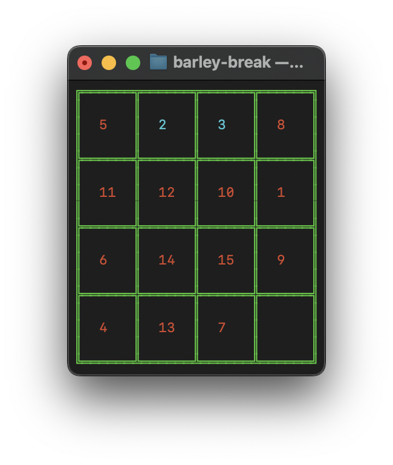

# Sliding Puzzle Game

## Overview

The Sliding Puzzle Game is a classic sliding puzzle where the player rearranges tiles to achieve a specific order. The puzzle is represented as a grid with numbered tiles and one empty space. The objective is to slide tiles into the empty space to solve the puzzle, which means arranging the tiles in numerical order from top-left to bottom-right.



## Features

- **Randomized Initial Board**: The game starts with a randomized arrangement of tiles.
- **Keyboard Controls**: Players can use the arrow keys to move tiles in the corresponding direction.
- **Victory Check**: The game detects when the puzzle is solved and announces victory.

## How to Play

1. **Start the Game**: Run the script to start the game.
2. **Move Tiles**: Use the arrow keys (`Up`, `Down`, `Left`, `Right`) to slide tiles into the empty space.
3. **Solve the Puzzle**: Arrange the tiles so that they are in numerical order from top-left to bottom-right.
4. **Win**: The game will announce victory when the puzzle is solved.

## How It Works

### Setup

- **Board Initialization**: The board is a grid of size 4x4, randomly populated with numbers from 0 to 15, where 0 represents the empty space.
- **Display**: The board is printed using colored borders and tiles to make it visually appealing.

### Controls

- **Keyboard Input**: The `pynput` library is used to listen for keyboard events. Arrow keys move the tiles in the corresponding direction.
- **Screen Clearing**: The `clear_screen` function is used to refresh the display after each move.

### Functions

- `set_up_board()`: Initializes and returns a randomized board.
- `clear_screen()`: Clears the terminal screen.
- `print_up_border()`, `print_down_border()`, `print_empty_row()`, `print_row_with_number()`, `print_separator()`, `print_board()`: Functions to display the board with borders and tiles.
- `hide_input()`: Hides the input on Unix systems (useful for hiding keyboard input).
- `get_indexes_of_empty()`: Finds the position of the empty space in the board.
- `swipe_up()`, `swipe_down()`, `swipe_right()`, `swipe_left()`: Functions to move tiles in the specified direction.
- `on_key_release(key)`: Handles key release events to move tiles and check for victory.
- `check_victory(board)`: Checks if the tiles are in the correct order to determine if the puzzle is solved.
- `play_game()`: Starts the game by setting up the board, hiding input, and listening for keyboard events.

## Requirements

- Python 3.x
- `colorama` library (for colored output)
- `pynput` library (for keyboard input)

## Running the Game

To run the game, simply execute the script in a terminal or command prompt that supports clearing the screen.

```bash
python barley-break.py
```